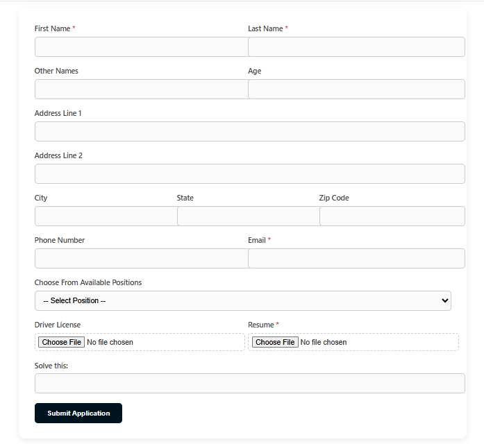
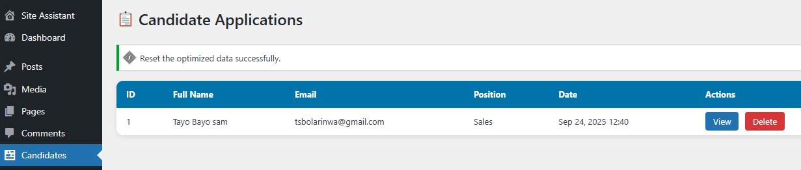
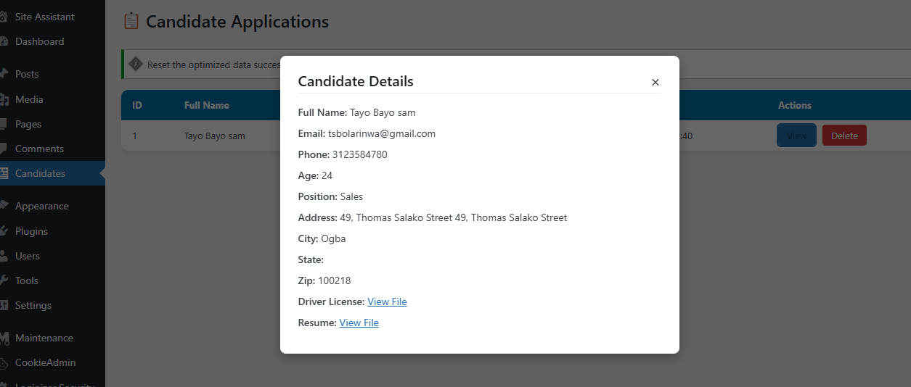

Candidate Manager is a custom WordPress plugin that provides a professional candidate application system. It allows job seekers to apply directly from your website, while administrators can view and manage applications from the WordPress dashboard.

Features

📝 Advanced Candidate Application Form

- . Collects applicant details such as name, age, address, phone, and email
- . 
- . Dropdown to select from available job positions
- . 
- . Upload fields for Driver’s License and Resume
- . 
-. Spam protection via math CAPTCHA puzzle
- 

🎨###  **Professional Styling**

- Clean, modern, mobile-responsive form
- 
- CSS-enhanced for better UX and accessibility

📊 **### Admin Dashboard**

- New “Candidates” menu in WordPress Admin
- 
- View all submitted applications
- 
- Inline modal for reviewing applicant details
- 
- File download links for uploaded documents

🔒 **### Security**

- Nonce verification to prevent CSRF attacks
- 
- File upload sanitization
- 
- Basic anti-spam math puzzle

⚡ **Installation**

1. Clone or download this repository.
2. Zip the candidate-manager folder.
3. Go to your WordPress dashboard → Plugins → Add New → Upload Plugin.
4. Upload the zip file and click Install Now.
5. Activate the plugin.

**Usage**

1.  Create a new page (e.g., Apply Now).
2.  Add the shortcode:  [candidate-form]

 **Future Improvements**

1. Export applications to CSV/Excel
2. Add email notifications for new submissions
3. Applicant approval/rejection system
4. More advanced CAPTCHA (Google reCAPTCHA)

**License**

**This project is open-source under the MIT License.**

## Screenshots

### Candidate Application Form

### Message Dashboard

### Message Dashboard Modal

